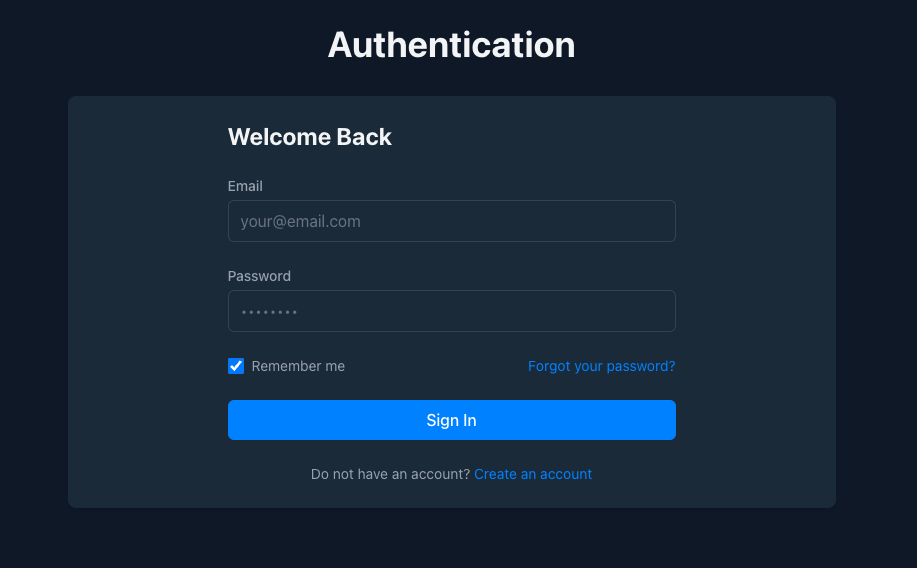
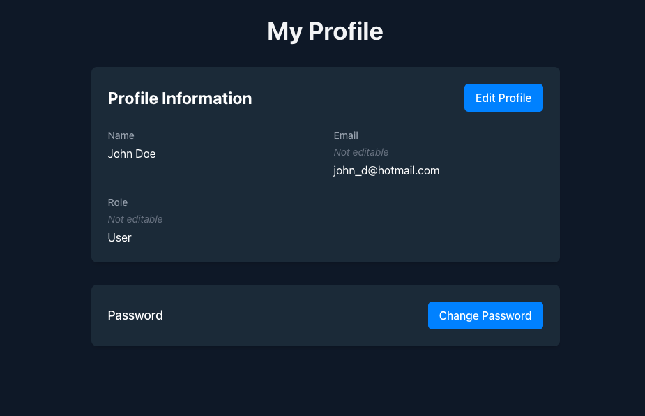
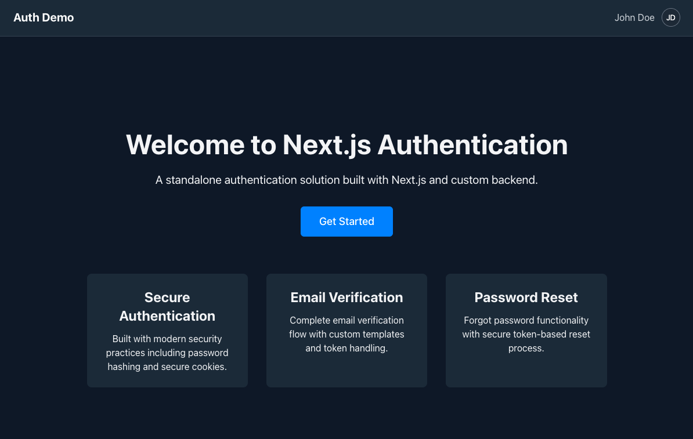

# 🔐 Next.js Authentication Project

Custom email/password authentication system with Redis session management for Next.js applications.

demo images:





## ✨ Features

- 📧 Email/password authentication
- 🔄 Sliding session management with Redis
- ✅ Email verification
- 🔑 Password reset functionality
- 🛡️ Protected routes with middleware
- 👤 User profile management
- 🍪 HTTP-only secure cookies
- 🧠 "Remember me" functionality

## 🛠️ Tech Stack

- **Framework**: Next.js 15 (App Router)
- **UI**: React 19 with Tailwind CSS
- **Language**: TypeScript
- **State**: React Context, Zustand
- **Validation**: React Hook Form with Zod
- **Database**: PostgreSQL on Neon.tech with Drizzle ORM
- **Sessions**: Redis on Upstash
- **Emails**: Nodemailer with Ethereal SMTP
- **Utils**: nanoid for session IDs

## 🧪 Testing & Deployment

- **Testing**: Jest, React Testing Library
- **Linting**: ESLint, Prettier
- **CI/CD**: GitHub Actions
- **Deployment**: Vercel
- **Tooling**: pnpm, Husky

## 🚀 Prerequisites

1. **Upstash Redis**

    - Sign up at [Upstash](https://upstash.com/)
    - Create Redis database
    - Copy UPSTASH_REDIS_URL and UPSTASH_REDIS_TOKEN

2. **Neon.tech PostgreSQL**

    - Sign up at [Neon.tech](https://neon.tech/)
    - Create database
    - Copy DATABASE_URL

3. **SMTP for Testing**
    - Use [Ethereal Email](https://ethereal.email/) for development
    - Generate test credentials

## 🏁 Getting Started

Install dependencies:

```bash
pnpm install
```

Setup database:

```bash
pnpm db:push
```

Run database UI (optional):

```bash
pnpm db:studio
```

Start development server:

```bash
pnpm dev
```

Visit [http://localhost:3000](http://localhost:3000)

## 📁 Project Structure

- `src/app/`: Routes and pages
- `src/components/`: UI components
- `src/lib/`: Database, validation, sessions
- `src/lib/session/`: Redis session management
- `src/lib/drizzle/`: Database schema and queries
- `src/lib/validation/`: Zod validation schemas
- `src/util/`: Helper functions
- `src/contexts/`: React contexts
- `src/hooks/`: Custom hooks

## 🔄 Sliding Session System

Our authentication uses a sliding window approach:

1. **Creation**: Sessions start with 24h expiry (30 days with "remember me")
2. **Extension**: Each request refreshes expiration time
3. **Expiry**: Sessions only expire after user inactivity
4. **Security**: Sessions use secure, HTTP-only cookies

### Implementation Details

The session system has three core components:

1. **`sessionManager.ts`**: Session CRUD operations
2. **`middleware.ts`**: Request interception and session validation
3. **Auth Routes**: Login/logout handling

Sessions are stored in Redis with the prefix `session:` followed by a unique nanoid. Each session contains the user object (excluding sensitive data) serialized as JSON.

## 📖 Learn More

- [Next.js Documentation](https://nextjs.org/docs)
- [Learn Next.js](https://nextjs.org/learn)
- [Next.js GitHub Repository](https://github.com/vercel/next.js)

## 🚢 Deployment

Deploy this project to [Vercel](https://vercel.com/new) with zero configuration.
